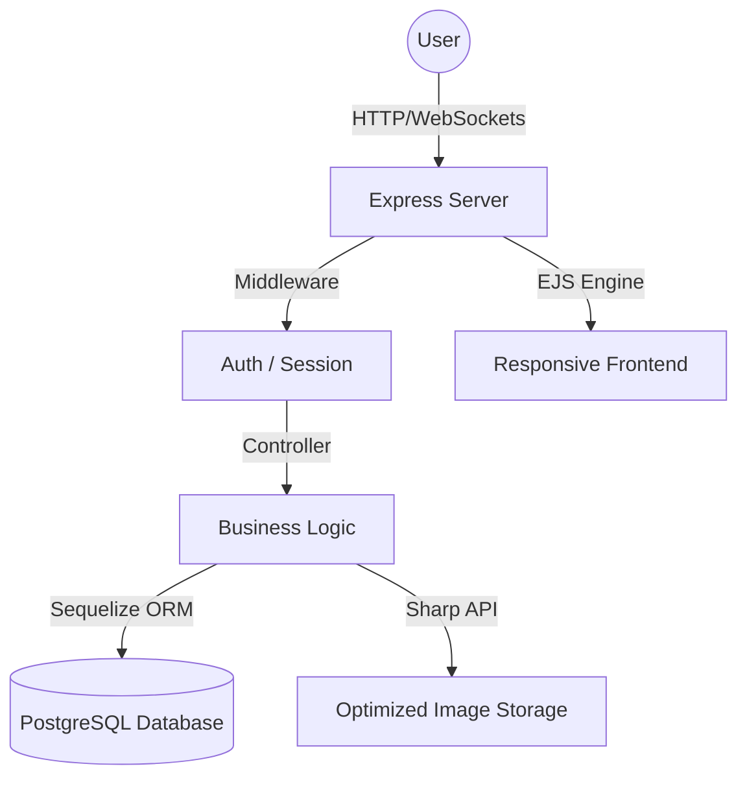

#  Hi there! I'm Rifqy Hazim

  

---

### 🚀 About Me

I am a highly driven **Full Stack Developer** specializing in building robust, scalable web applications with a focus on **Clean Architecture** and **High Performance**. My primary focus right now is evolving **[MediMart.adv](https://github.com/rifqyhazim22/medimart.adv)**, a sophisticated health marketplace.

- 🛠️ Currently mastering **Node.js**, **Express**, and **PostgreSQL**.
- 📐 Passionate about **MVC Design Patterns** and **Database Optimization**.
- ⚡ Obsessed with **Gen Z Aesthetics** & **Premium User Experiences**.
- 🔐 Advanced knowledge in **JWT/Session Auth**, **Payment Gateways (Xendit)**, and **Image Processing**.

---

### 🏗️ Technical Architecture (The Reality)

The foundation of my work (as seen in `medimart.adv`) follows a strict **MVC & Clean Logic** structure:

---

### 🛠️ Tech Stack & Tools

  
  
  
  
  
  
  

---

### 📊 GitHub Stats

  
  

---

### 🐍 Contribution Activity

  

---

### 📫 Get In Touch

  
  

 

  

