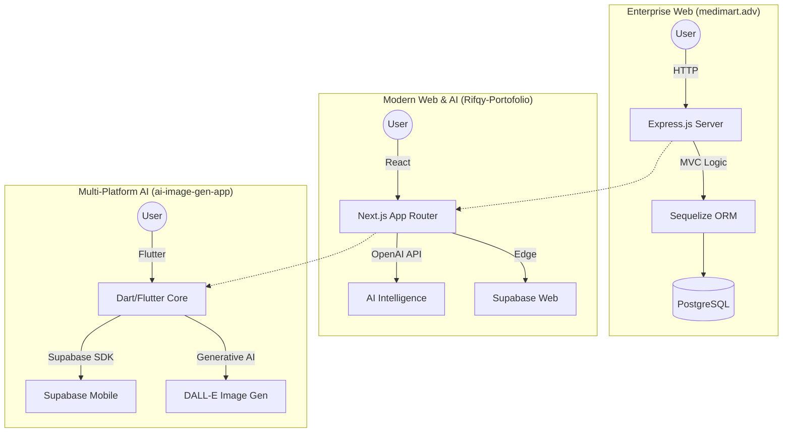

#  Hi there! I'm Rifqy Hazim

  

---

### 🚀 About Me

I am a technical-first **Multi-Platform Developer** specializing in bridging the gap between robust backend systems, premium web experiences, and AI-driven mobile applications. My expertise spans from building enterprise-grade marketplaces with **Clean Architecture** to crafting high-performance, AI-integrated ecosystems.

- 🛠️ Currently evolving **[MediMart.adv](https://github.com/rifqyhazim22/medimart.adv)** (Clean MVC) and **[ai-image-gen-app](https://github.com/rifqyhazim22/ai-image-gen-app)** (Flutter/AI).
- 📐 Expert in **Next.js App Router**, **Flutter/Dart Mobile**, and **Relational Database Design**.
- ⚡ Focused on **Gen Z Aesthetics**, **Micro-animations**, and **AI-Assisted Workflows**.
- 🔐 Skilled in **Supabase**, **Xendit Payments**, **OpenAI/DALL-E API**, and **ReactFlow**.

---

### 🏗️ Technical Ecosystem (Multi-Paradigm)

My work spans three major architectural worlds, allowing me to build for any platform:

---

### 🛠️ Tech Stack & Tools

  
  
  
  
  
  
  
  

---

### 🌟 Featured Projects

- **[MediMart.adv](https://github.com/rifqyhazim22/medimart.adv)**: Enterprise health marketplace focusing on secure transactions and role-based management.
- **[ai-image-gen-app](https://github.com/rifqyhazim22/ai-image-gen-app)**: A powerful **Flutter** mobile application integrated with **DALL-E** and **Supabase** for real-time AI image generation and storage.
- **[Rifqy-Portofolio](https://github.com/rifqyhazim22/Rifqy-Portofolio)**: High-end Next.js showcase featuring interactive nodes via ReactFlow and AI-assisted UX.

---

### 📊 GitHub Stats & Activity

  
  

---

### 🐍 Contribution Activity

  

---

### 📫 Get In Touch

  
  

 

  

